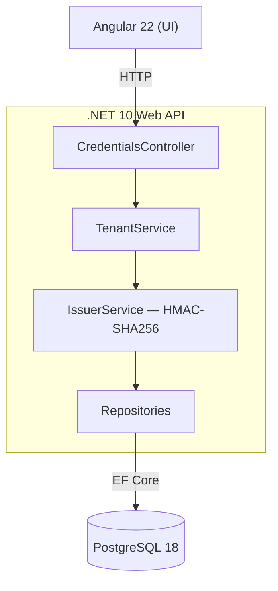

# Club Córdoba Wallet

Prueba técnica: sistema de emisión y gestión de credenciales digitales verificables para los socios de un club de fútbol. Separa el rol de negocio (**Tenant**, el club) del rol de emisión (**Issuer**), que firma criptográficamente cada credencial (HMAC-SHA256, mock de firma digital) para garantizar su integridad.

## Cómo levantar el proyecto

**Requisito:** tener [Docker](https://docs.docker.com/get-docker/) instalado (incluye Docker Compose).

**Un solo comando, sin ningún paso previo** (no hace falta crear `.env`, ni generar migrations, ni instalar nada a mano):

```bash
docker-compose up --build
```

La primera vez tarda unos minutos (descarga imágenes base y compila backend/frontend). Al terminar:

- **Frontend**: http://localhost:4200
- **Backend**: http://localhost:5000

Postgres, la migración inicial de la base y la conexión entre los 3 servicios quedan resueltos solos. No hay ningún valor hardcodeado: toda la configuración (contraseña de la base, clave de firma del Issuer, orígenes CORS) sale de variables de entorno con default de desarrollo ya definido en `docker-compose.yml` — ver el detalle en [docs/decisiones.md](docs/decisiones.md#infraestructura--docker).

Para usar tus propios valores en vez de los defaults de desarrollo (opcional, no necesario para evaluar el proyecto):

```bash
cp .env.example .env
# editar .env con tus valores
docker-compose up --build
```

Instrucciones para levantar cada parte sin Docker (por si hace falta debuggear algo puntual): [backend/README.md](backend/README.md) y [frontend/README.md](frontend/README.md).

## Arquitectura



Detalle completo en [docs/arquitectura.md](docs/arquitectura.md).

## Stack

- **Backend**: .NET 10, Clean layered (Domain/Application/Infrastructure/Api), CQRS manual
- **Frontend**: Angular 22 + Angular Material, NgModules con lazy loading
- **Base de datos**: PostgreSQL 18 (JSONB para la credencial firmada, EF Core Migrations)
- **Infra**: Docker Compose

## Estructura del repositorio

```
club-cordoba-wallet/
├── docker-compose.yml
├── .env.example
├── docs/
│   ├── decisiones.md      # Decisiones de diseño ante puntos no especificados
│   ├── arquitectura.md    # Arquitectura y flujos UC01/UC02
│   └── modelo-datos.md    # DER y justificación del modelo
├── backend/                # .NET 10 — ver backend/README.md
├── frontend/                # Angular 22 — ver frontend/README.md
└── infra/                   # ver infra/README.md
```

## Documentación adicional

- [Decisiones de diseño](docs/decisiones.md)
- [Arquitectura](docs/arquitectura.md)
- [Modelo de datos](docs/modelo-datos.md)
- [README backend](backend/README.md)
- [README frontend](frontend/README.md)
- [README infra](infra/README.md)

## Alcance

Cubre UC01 (alta de credencial) y UC02 (listado), con manejo de errores en la firma (si el Issuer falla, no se persiste nada). Explícitamente fuera de alcance: verificación de credenciales, revocación/cambio de estado, autenticación/autorización, fidelidad estricta a la spec W3C VC/DID, paginación.
