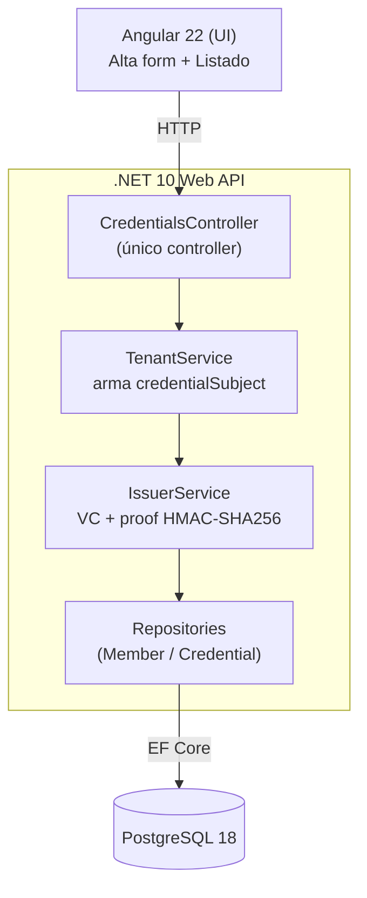

# Arquitectura

## Vista general



## Capas (Clean layered)

```
ClubCordobaWallet.Domain          → Entidades (Member, Credential), enums, excepciones. Sin dependencias.
ClubCordobaWallet.Application     → Commands/Queries + Handlers (CQRS manual), DTOs, interfaces, Result pattern.
ClubCordobaWallet.Infrastructure  → EF Core (DbContext, configuraciones, migrations), repositorios,
                                     IssuerService, TenantService, recursos .resx.
ClubCordobaWallet.Api             → Controllers, middleware, Program.cs, configuración.
```

Cada capa expone su propio `DependencyInjection.cs` (`AddApplication()`, `AddInfrastructure()`), registrado en `Program.cs` sin que la Api conozca los detalles internos de cada capa.

Dentro de `Application`, `Common/` e `Interfaces/` son transversales (usados por cualquier feature); las features de negocio viven bajo `Features/` (hoy sólo `Features/Credentials/`, con `Commands/`, `Queries/` y `Dtos/` propios) — evita que una feature quede al mismo nivel que el código transversal.

## Flujo UC01 — Alta de credencial

1. El frontend busca socios por **prefijo** de DNI (`GET /credentials/members/search?dni=`, reactivo con debounce) para autocompletar — opcional, no bloqueante. Devuelve hasta 10 candidatos; el operador elige uno de una lista (o sigue tipeando el form a mano si es socio nuevo).
2. El admin completa/confirma nombre, apellido, DNI, categoría y foto, y envía el form.
3. `POST /credentials` llega al `CredentialsController`, que invoca `CreateCredentialCommandHandler`.
4. El handler busca un `Member` existente por DNI; si no existe, lo crea (nuevo DID + siguiente `numeroSocio` de la secuencia).
5. `TenantService.BuildSubject()` arma el `credentialSubject` con los datos del socio + categoría/foto del form.
6. `IssuerService.Issue()`:
   - Agrega `id`, `type`, `issuer`, `validFrom`, `validUntil`.
   - Serializa el JSON canónico (sin `proof`), en orden alfabético ordinal, sin escapar unicode.
   - Calcula `HMAC-SHA256` sobre ese JSON con la clave secreta (env var).
   - Arma el `proof` y devuelve la VC completa como JSON.
   - Si la clave HMAC no está configurada, lanza `IssuerSigningException`.
7. Si el paso 6 falló, el handler devuelve `Result.Fail` — **no se persiste nada**: `Member` y `Credential` se agregan al `DbContext` sin commit propio, y el único `SaveChangesAsync` (vía `IUnitOfWork`) recién se ejecuta después de que el Issuer confirma la firma.
8. Si tuvo éxito, se ejecuta ese único `SaveChangesAsync`: `Member` (si es nuevo) y `Credential` con la VC completa en `vc_json` quedan persistidos juntos.
9. El controller responde con el DTO mínimo (`memberNumber`, `validFrom`, `validUntil`) para la pantalla de confirmación.

## Flujo UC02 — Listado

1. `GET /credentials` → `GetCredentialsQueryHandler` trae todos los `Credential`, parsea el `vc_json` de cada uno y arma el DTO mínimo (foto, nombre, apellido, categoría, número de socio, vigencia, estado).
2. Si no hay credenciales, se devuelve un array vacío — el frontend renderiza el estado vacío.
3. Al hacer clic en una credencial, `GET /credentials/{id}` trae el detalle completo (incluye `issuer` y `proof.type`, sin exponer `proofValue` crudo en el DTO).

## Ver también

- [Modelo de datos](modelo-datos.md)
- [Decisiones de diseño](decisiones.md)
