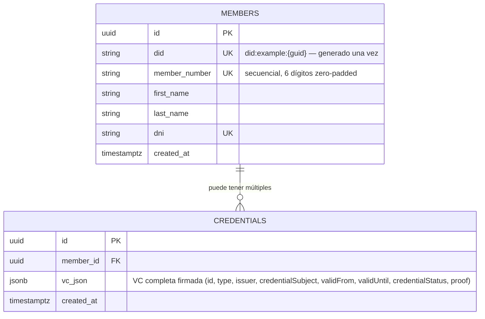

# Modelo de datos

## Motor: PostgreSQL 18

Elegido por soporte nativo de JSONB (para persistir la VC completa tal cual la firma el Issuer) y por ser gratuito/ampliamente soportado en .NET vía Npgsql.

## Diagrama entidad-relación



## Por qué `vc_json` y no columnas descompuestas

El `IssuerService` produce un documento JSON ya firmado — el `proofValue` es el resultado de un HMAC calculado sobre una serialización canónica exacta (orden de claves, encoding, formato de fechas). Si se descompusiera la VC en columnas y se reconstruyera el JSON al leerla, cualquier diferencia mínima de serialización invalidaría la correspondencia con la firma original. Persistir el JSON tal cual salió del Issuer garantiza que lo que se guarda es exactamente lo que se firmó.

Las columnas propias de `credentials` se limitan a metadatos de la tabla (`id`, `member_id`, `created_at`); todo el contenido de la VC vive en `vc_json`. El listado y el detalle se arman parseando ese JSON en la capa de aplicación.

## Por qué existe `members`

El enunciado no pide una entidad de socio explícita, pero especifica que `credentialSubject.id` (el DID) y `numeroSocio` deben "generarse una vez y persistirse" — lo cual describe un ciclo de vida propio, independiente del de cada credencial. Ver [decisiones.md](decisiones.md) para el detalle completo de esta decisión.

## Secuencia `member_number_seq`

```sql
CREATE SEQUENCE member_number_seq START 1 INCREMENT 1;
-- uso: SELECT nextval('member_number_seq') → formateado a "D6" → "000123"
```

Se acepta que puedan quedar gaps (números no usados) si el alta de un socio se confirma pero la emisión de su primera credencial falla luego — las secuencias de PostgreSQL no son transaccionales. No hay requisito de continuidad estricta en el enunciado.

## Migrations

El schema se gestiona con EF Core Migrations (no `init.sql` manual). Se aplican automáticamente al arrancar la API (`db.Database.Migrate()` en `Program.cs`). Ver el README del backend para generar la migration inicial.
